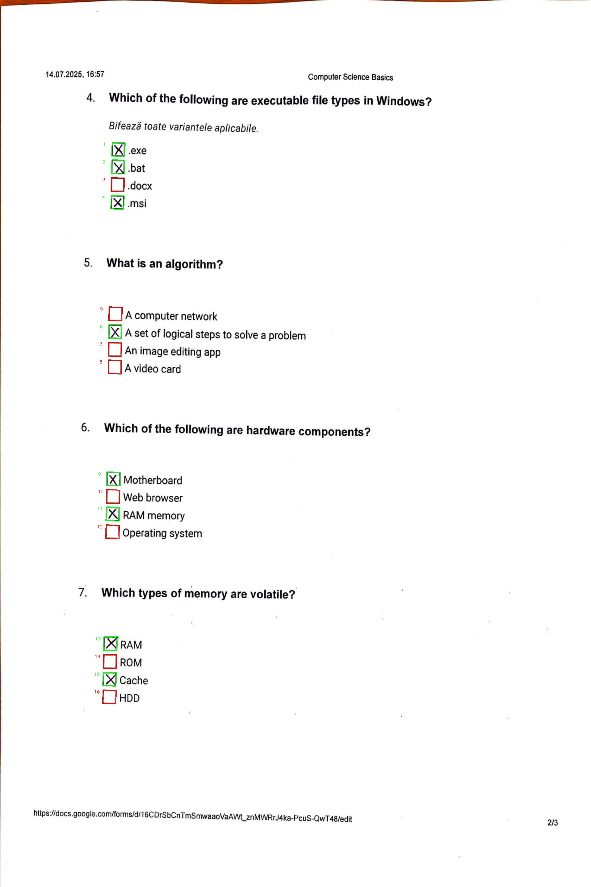

# Checkbox Recognition — SSIP 2025

A **computer vision and image processing system** for detecting checkboxes in scanned or photographed documents and determining whether they are checked or unchecked.

🏆 **2nd Place — Summer School on Image Processing (SSIP) 2025**

<p align="center">
  
  
</p>

## Overview

The project explores a lightweight approach to checkbox recognition using **classical image processing**, without requiring a trained machine-learning model.

The pipeline is designed to work with imperfect document images and handles challenges such as blur, shadows, noise, varying checkbox sizes, and differences in document quality.

For each processed image, the system produces:

- an annotated image showing the detected checkboxes;
- a checked/unchecked status for each detection;
- checkbox coordinates;
- a CSV file with the structured results.

## Processing Pipeline

```text
Input image
    ↓
Grayscale conversion + Gaussian blur
    ↓
Adaptive thresholding
    ↓
Morphological operations
    ↓
Contour detection
    ↓
Geometric filtering
    ↓
ROI + Otsu thresholding
    ↓
Core / ring pixel analysis
    ↓
Checked / unchecked decision
    ↓
Annotated image + CSV results
```

### 1. Image preprocessing

The image is converted to grayscale, smoothed with a Gaussian blur, and binarized using adaptive thresholding. Morphological closing and dilation help reconnect broken checkbox borders and reduce the effect of noise.

### 2. Checkbox detection

Contours are extracted from the processed image and simplified using polygon approximation. Candidate checkboxes are filtered using geometric properties such as:

- contour area;
- aspect ratio;
- number of polygon vertices;
- proximity to already detected boxes.

### 3. Checkbox status analysis

For each detected checkbox, the system extracts a padded Region of Interest (ROI) and applies Otsu thresholding.

The central region of the checkbox is compared with its surrounding area using black-pixel ratios. The difference between these regions is then used to determine whether the checkbox is **checked** or **unchecked**.

### 4. Output generation

The system saves:

- annotated images with numbered detections;
- green/red visual indicators for checkbox status;
- checkbox coordinates;
- checked/unchecked labels;
- structured CSV output.

## Results

The current public repository reproduces the following detection results:

| Metric | Result |
|---|---:|
| Detection score | **97.22%** |
| True positives | **768** |
| False positives | **20** |
| False negatives | **2** |

> **Metric note:** the detection score evaluates whether predicted checkbox coordinates match the supplied ground-truth coordinates within a **±10 pixel tolerance**. It is not a separate accuracy measurement for the checked/unchecked classification.

## Dataset

The repository contains **30 scanned or photographed document images** covering different image-quality conditions, including examples with:

- blur;
- shadows and uneven lighting;
- salt-and-pepper noise;
- different checkbox sizes and positions.

Ground-truth coordinate files used for evaluation are available in `dataset_coordinates/`.

## Tech Stack

- **Python**
- **OpenCV**
- **NumPy**
- **Pandas**
- **Matplotlib**
- **Jupyter Notebook**

## Repository Structure

```text
.
├── Checkbox_Recognition_SSIP2025.ipynb
├── requirements.txt
├── dataset_coordinates/
├── input/
├── output/
└── notebooks/
    └── Checkbox_Recognition_SSIP2025_original_colab.ipynb
```

The main notebook is a portable version that uses repository-relative paths.

The original SSIP/Google Colab notebook is preserved in `notebooks/` together with its saved competition-time outputs.

## Run Locally

Clone the repository:

```bash
git clone https://github.com/Schwarz28Iva/checkbox-recognition-ssip-2025.git
cd checkbox-recognition-ssip-2025
```

Install the dependencies:

```bash
pip install -r requirements.txt
```

Start Jupyter:

```bash
jupyter notebook
```

Open `Checkbox_Recognition_SSIP2025.ipynb` and run the cells from top to bottom.

The processed images will be written to `output/`, and the structured detections will be saved to:

```text
checkbox_detection_results.csv
```

## Limitations

The current approach can be sensitive to:

- heavily blurred or noisy images;
- partially filled or irregular checkboxes;
- strongly rotated or skewed documents;
- document layouts that differ substantially from the evaluation set.

## Possible Improvements

Future work could include:

- automatic perspective and skew correction;
- more adaptive threshold selection;
- support for additional form elements such as radio buttons and text fields;
- a more general document-processing pipeline;
- evaluation of checked/unchecked classification independently from checkbox detection.

## Acknowledgment

This project was developed and presented during **Summer School on Image Processing (SSIP) 2025**, where it received **2nd place**.
